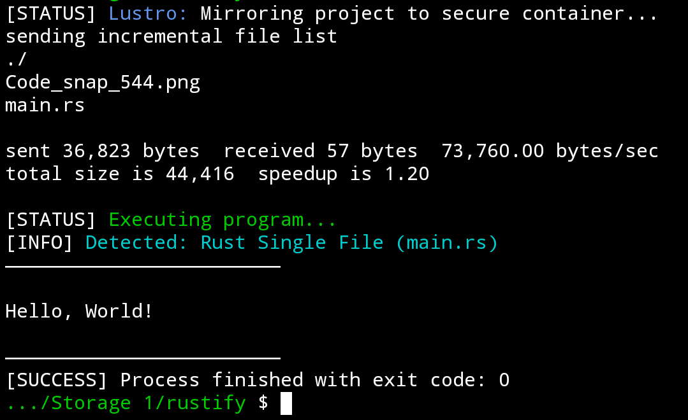

# lustro
a lightweight CLI utility for Termux designed to bridge the gap between Android's shared storage and Linux's execution environment.

## The problem
Android's shared storage (/sdcard) uses a filesystem that does not support Linux execution permissions (chmod +x). This makes it impossible to run compiled binaries (like those from Rust or C) directly from your project folders in shared storage.

## The Solution: The "Mirror" Workflow
**Lustro** acts as a mirror. It synchronizes your source code from the "no-exec" shared storage into a secure, high-performance internal Termux container. It then automatically detects the programming language, compiles the code, and executes it—all while keeping your original storage clean of build artifacts.

## Features
- **Smart Mirroring:** Uses rsync to mirror only changed files, preserving build caches (like Rust's target/ folder) for lightning-fast incremental compilation.
- ​**Auto-Detection:** Instantly recognizes Rust (Cargo or single-file), C (Clang), and C++ (Clang++).
- **​Safety First:** Includes built-in guards to prevent accidental mirroring of root storage and asks for confirmation if the project size is too large.
- **​Clean Workflow:** Keeps your shared storage folders tidy by confining binaries and build junk to the internal container.

## Installation
1. Ensure you have the required tools:
```bash
pkg install rsync clang rust -y
```
2. Download the script and move it to your binaries:
```bash
mv lustro $PREFIX/bin/lustro
chmod +x $PREFIX/bin/lustro
```

## Usage
Simply navigate to any project folder in your shared storage and run:
```bash
lustro
```

## Example

